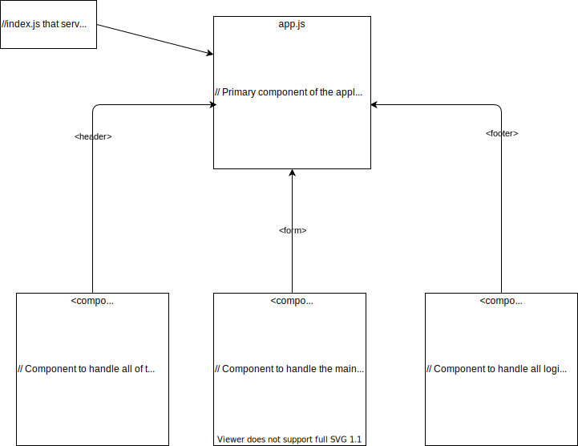

# LAB - Class 27

## Project: RESTy

A simple API testing tool built out in React.

### Author: Ben Hill, Jon Lee, Joe Pennock

### Links and Resources

- [codesandbox](https://codesandbox.io/live/574qidj?file=/src/app.js)
- [ci/cd](http://xyz.com) (GitHub Actions)
- [back-end server url](http://xyz.com) (when applicable)
- [front-end application](http://xyz.com) (when applicable)

### User Stories

The following user/developer stories detail the major functionality for this phase of the project.

- As a user, I expect an easy to read and understand user interface so that I can use the application intuitively
- As a user, I want to enter the URL to a REST API and select the REST method to use to access it
- As a user, I want visual confirmation that my entries and selections are valid so that I have confidence the application will be able to fetch the API data that I’ve requested

And as developers, here are the high level development tasks that address the above end user requirements

- Create a visually appealing site with a Header, Footer, and a large content area
- Create a form that asks for a URL
- Create buttons that let the user choose from the REST methods (get, post, put, delete)
- When the form is filled out, and the button is clicked, display the URL and the method chosen

### Setup

#### `.env` requirements (where applicable)

i.e.

- `PORT` - Port Number
- `MONGODB_URI` - URL to the running mongo instance/db

#### Required project dependencies

- React

#### How to initialize/run your application (where applicable)

- e.g. `npm start`

#### How to use your library (where applicable)

#### Tests

- How do you run tests?
- Any tests of note?
- Describe any tests that you did not complete, skipped, etc

#### UML
Phase1 UML diagram:

